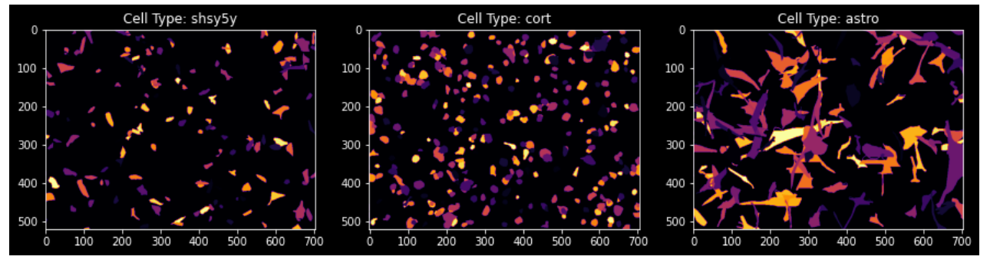
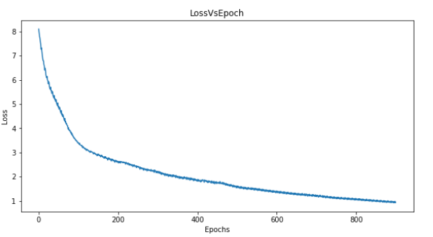

# U-Net Implementation in Tensorflow 1.15
*on Sartorius Cell Image Segmentation Dataset on Kaggle*

***from the paper***: [https://arxiv.org/abs/1505.04597]

In this paper, we present a network and training strategy that relies on the strong use of data augmentation to use the available annotated samples more efficiently. The architecture consists of a contracting path to capture context and a symmetric expanding path that enables precise localization.

This is a simple implementaiton of the model mentioned in the paper. 

**Dataset can be downloaded from here:** https://www.kaggle.com/c/sartorius-cell-instance-segmentation/data

### About the implementation

The dataset masks are in RLE format. So firest this rle format is converted into image mask of numpy array and then used ofr training. 
- data.py : This .py file pre-processes the RLE(.csv) file and produces numpy array of image mask. This file also pre-processes the input image into numpy array.
- utils.py : This .py file contains functions that are used to create U-net network.
- unet.py : Actual implementation of U-net architecture.
- main.py : This file is used for training the U-net on Sartorius Cell Segmentation dataset.
- train.csv: Train masks in RLE format.

### Result

**LOSS**

### Conclusion

This project is on a implementation of U-net on a Multi-class Segmentation problem.
