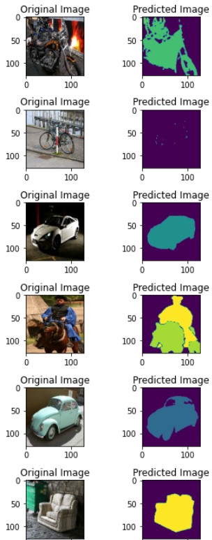

# SegNet Implementation in Tensorflow 1.15
*on PASCAL VOC 2012 Dataset*

***from the paper***: [https://arxiv.org/abs/1511.00561]

We present a novel and practical deep fully convolutional neural network architecture for semantic pixel-wise segmentation termed SegNet. This core trainable segmentation engine consists of an encoder network, a corresponding decoder network followed by a pixel-wise classification layer. The architecture of the encoder network is topologically identical to the 13 convolutional layers in the VGG16 network. The role of the decoder network is to map the low resolution encoder feature maps to full input resolution feature maps for pixel-wise classification. The novelty of SegNet lies is in the manner in which the decoder upsamples its lower resolution input feature map(s). Specifically, the decoder uses pooling indices computed in the max-pooling step of the corresponding encoder to perform non-linear upsampling. This eliminates the need for learning to upsample. The upsampled maps are sparse and are then convolved with trainable filters to produce dense feature maps.

**Dataset can be downloaded from here:** https://www.kaggle.com/huanghanchina/pascal-voc-2012

### About the implementation

The dataset masks are one-hot encoded into shape [height,width,number of classes]. Description of each files.
- pascal_voc.py : This .py file pre-processes the PASCAL VOC datset file and produces one-hot encoded numpy array of image mask. This file also pre-processes the input image into numpy array.
- network.py : This .py file contains functions that are used to create SegNet network.
- utils.py : Implementation of utils functions used for SegNet Network.
- main.py : This file is used for training the Segnet on PASCAL VOC 2012.

### Result

### Conclusion

This project is on a implementation of SegNet on a Multi-class Segmentation problem.
